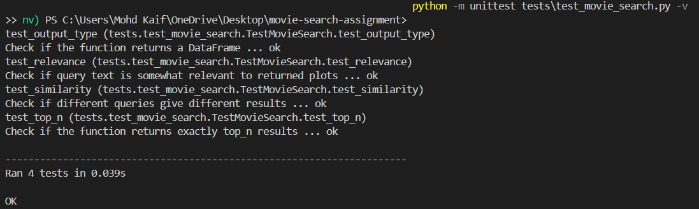

# Movie Semantic Search Assignment

This repository contains my solution for the semantic search on movie plots assignment.
The system uses [Sentence Transformers](https://www.sbert.net/) to embed movie plots and allows users to search for semantically similar movies using cosine similarity.

## Example Search Result



## Setup
Clone the repository and install dependencies:
```bash
git clone https://github.com/lowbare3/movie-search.git
cd movie-search
python -m venv ai_sys
ai_sys\Scripts\activate
pip install -r requirements.txt

```
## Running the notebook
Launch Jupyter and open the solution notebook:
```bash
jupyter notebook
```
Open movie_search_solution.ipynb to view the solution.

## Testing
Unit tests are included under tests/test_movie_search.py. Run them with:
```bash
python -m unittest tests/test_movie_search.py -v
```
## Usage
```bash
from movie_search import search_movies

results = search_movies("spy thriller in Paris", top_n=3)
print(results)
```
Should see the results as shown below:


